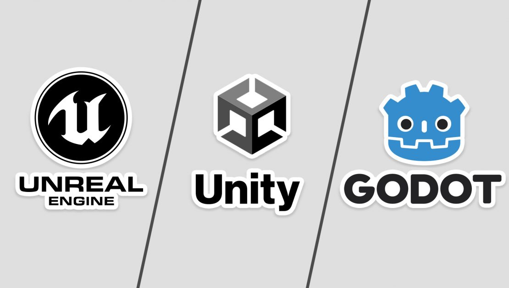

## Hi there, i'm Willian - [androide23] 🎮

## I am a Systems Analyst, Gamer, Musician, and Manga Reader 😜
- I currently work as a Systems Analyst
- I have a degree in Computer Science
- I am studying Game Development
- I like to stay up to date with hardware releases

## 🕹 Game Development 🕹
 

## Technologies

          
          
          
        
    
    
    
    
    
    
    
                  

 

## About me
It all started with a child who used to watch his parents playing games on that old tube-screen computer, games like:

- xena
- top gear
- aero fighter
- The bruce lee story
- metal slug
- final fight 
- among others from the **SNES** and **Nintendo64 emulator** 

Over time, I fell in love with FPS games in the style of Counter-Strike and similar competitive titles (Crossfire, Point Blank, Sudden Attack, etc.).

As the years went by, I became interested in the technology field. Around the age of 11 or 12, I started studying **HTML** and **CSS** just for fun, and later I became curious about understanding how games are made.

During my technical course in IT, I began learning programming fundamentals, which boosted my desire to work in the technology field as a programmer.

While studying Computer Science in college, I started working as a Systems Analyst, which allowed me to dive deeper into the programming world and consequently increased my curiosity about game development after completing the **Digital Games** course.

Today, after experiencing various game genres, I want to make game development another hobby in my life and to be able to create games from ideas that occasionally come to my mind and, if possible, collaborate on projects that can bring me more knowledge or even extra income.

Finally, my main goal with games at the moment is to be able to include ideas that promote joy and companionship through the moments they can provide to those who are playing.

##     
- 📫 How to reach me: willian12garcia@gmail.com